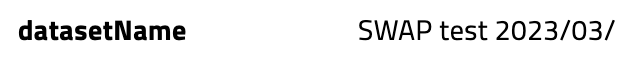
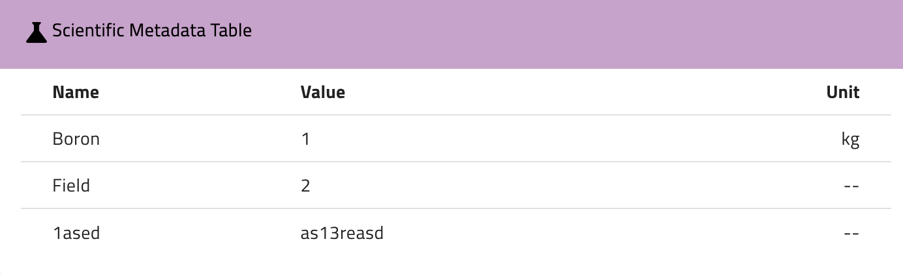
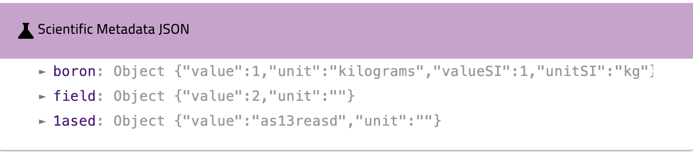
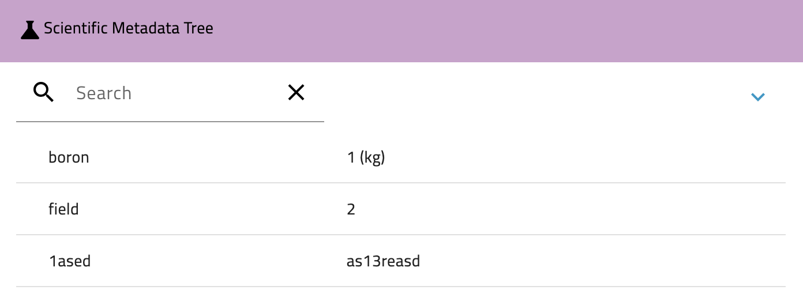

# Dynamic Dataset Detail Component - Frontend Configuration Guide

## Overview

This guide provides details on configuring the **Dynamic Dataset Detail Component** on the frontend. This component can be customized to display dataset information in various templates and layouts based on your needs.
The configuration needs to be provided or mounted in the location specified by the environment variable `FRONTEND_CONFIG_FILE` (default `src/config/frontend.config.json`).

## Configuration guide

The `datasetDetailComponent` field allows you to customize the display of dataset details using 4 template types. Each template type is rendered based on the order property, which determines the display priority. The available template types are listed in the Component Configuration Table.

You can define labels directly using the `label/source` property, or use them as keys for localization. If no localization configuration is provided, the template will fall back to using the `label/source` as the default value.

The `enableCustomizedComponent` flag enables or disables the dynamic component. If set to false, the default dataset detail component will be used. In the customization field, you can provide configuration for the components, including their types, labels, and other settings.

Below you can find the example configuration, but for more advanced customizations, refer to the Component Configuration Table for detailed options on each template type and field configuration.

```json
"datasetDetailComponent": {
  "enableCustomizedComponent": true,
  "customization": [
    {
      "type": "regular",
      "label": "General Information",
      "order": 0,
      "row": 1,
      "col": 4,
      "fields": [
        {
            "element": "text",
            "source": "datasetName",
            "order": 0
        },
        {
            "element": "copy",
            "source": "pid",
            "order": 1
        },
        {
            "element": "internalLink",
            "source": "proposalIds",
            "order": 2
        },
        {
            "element": "text",
            "source": "description",
            "order": 3
        }
        {
            "element": "text",
            "source": "scientificMetadata.start_time.value",
            "order": 4
        },
      ]
    },
    {
      "type": "attachments",
      "label": "Scientific Metadata",
      "order": 1,
      "row": 1,
      "col": 6,
      "options": { "limit": 10, "size": "large" }
    },
    {
      "type": "scientificMetadata",
      "label": "Scientific Metadata",
      "viewMode": "table",
      "order": 2,
      "row": 1,
      "col": 10,
    },
    {
      "type": "datasetJsonView",
      "label": "Metadata JSON view",
      "order": 3,
      "row": 1,
      "col": 10,
    }
  ]
}
```

## Component Configuration Table

| **Template Type**      | **Configurable Fields** | **Field Description**                                                                                                                   | **Configurable Options**                                                                 | **Example**                                                              |
| ---------------------- | ----------------------- | --------------------------------------------------------------------------------------------------------------------------------------- | ---------------------------------------------------------------------------------------- | ------------------------------------------------------------------------ |
| **regular**            | **label**               | Title for the section that can be customized.                                                                                           | - `label`: Custom label for the section (e.g., "General Information")                    | `"label": "General Information"`                                         |
|                        | **order**               | Controls the display order of the Regular section in the UI                                                                             | - `order`: Integer, determines position in the UI                                        | `"order": 0`                                                             |
|                        | **fields**              | List of fields to display within the section. It should contain an array of objects, each with `element`, `source`, and `order` fields. |                                                                                          | `{"fields": [{"element": "text", "source": "datasetName", "order": 0}]}` |
|                        | - **element**           | Defines the type of data to display in the row (e.g., text, copy, tag, linky, date, internalLink).                                      | - `element`: Field type (e.g., `text`, `copy`, `tag`, `linky`, `date`, `internalLink`)   | `"element": "text" `                                                     |
|                        | - **source**            | Specifies the dataset property to display, and it must match a field in the `OutputDatasetDto`, or to be _instrumentName_ .                                        | - `source`: Dataset property name                                                        | `"source": "datasetName"`                                                |
|                        | - **order**             | Controls the display order of the field in the fields.                                                                                  | - `order`: Integer, defines the sequence of fields in the UI. Lower values appear first. | `"order": 1`                                                             |
| **attachments**        | **label**               | Custom label for the section that can be configured.                                                                                    | - `label`: Custom title for the attachments section (e.g., "Gallery")                    | `"label": "Scientific Metadata"`                                         |
|                        | **order**               | Controls the display order of the attachments section in the UI.                                                                        | - `order`: Integer, determines sequence within the template.                             | `"order": 1`                                                             |
|                        | **options**             | Allows configuration for the display of attachments.                                                                                    |                                                                                          | `{"options": {"limit": 10, "size": "large"}}`                            |
|                        | **options.limit**       | Limits the number of items to display in the attachment section.                                                                        | - `limit`: Number of items to display (e.g., 10).                                        | `"limit": 10`                                                            |
|                        | **options.size**        | Configures the display size of attachments (small, medium, or large).                                                                   | - `size`: Display size (small, medium, large).                                           | `"size": "small"`                                                        |
| **scientificMetadata** | **label**               | Customizable label for the scientific metadata section.                                                                                 | - `label`: Custom section title (e.g., "Scientific Metadata")                            | `"label": "Scientific Metadata"`                                         |
|                        | **viewMode**            | Defines how the scientific metadata is rendered (as a table, JSON, or tree view).                                                       | - `viewMode`: `table`, `json`, or `tree`                                                 | `"viewMode": "table"`                                                    |
|                        | **order**               | Controls the display order of the scientific metadata section.                                                                          | - `order`: Integer, determines position in the UI                                        | `"order": 2`                                                             |
|                        | **source**              | **Optional** field to specify a path to nested scientificMetadata sub-objects. When provided, displays only the specified nested object instead of the entire scientificMetadata. | - `source`: Path to nested metadata (e.g., "scientificMetadata.instrumentProperties.value") | `"source": "scientificMetadata.instrumentProperties.value"`              |
| **datasetJsonView**    | **label**               | Label for the JSON view section.                                                                                                        | - `label`: Custom section title (e.g., "Metadata JSON view")                             | `"label": "Metadata JSON view"`                                          |
|                        | **order**               | Controls the display order of the dataset JSON view.                                                                                    | - `order`: Integer, determines position in the UI                                        | `"order": 3`                                                             |

---

## Template Types Example Preview

- **regular:** Displays dataset properties in configurable rows.
  Can be customized with different elements.

  - text: Displays a simple string

    

  - linky: Automatically transforms URLs or emails into clickable links.

    

  - copy: Displays a copy-to-clipboard button

    

  - date: Displays a formatted date based on the dateFormat value in the frontend config file

    

  - tag: Displays a list of items as tags

    

  - internalLink: Converts the value into a clickable link for internal navigation. Supported fields: `instrumentIds`, `proposalIds`, `sampleIds`, and `inputDatasets`.

    

- **scientificMetadata:** Displays metadata in different views:

  - table

    

  - json

    

  - tree

    

- **datasetJsonView:** Displays the dataset as a JSON document as addition.
- **attachments:** Displays the attachments associated with the dataset. You can configure options like display size and limit the number of items.
