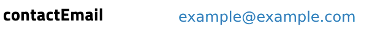

# Dynamic Dataset Detail Component - Frontend Configuration Guide

## Overview

This guide provides details on configuring the **Dynamic Dataset Detail Component** on the frontend. This component can be customized to display dataset information in various templates and layouts based on your needs.
The configuration needs to be provided or mounted in `/src/config/frontend.config.json`

## Component Configuration Table

| **Template Type**       | **Configurable Fields** | **Field Description**                                                                                                                   | **Configurable Options**                                                                 | **Example**                                                              |
| ----------------------- | ----------------------- | --------------------------------------------------------------------------------------------------------------------------------------- | ---------------------------------------------------------------------------------------- | ------------------------------------------------------------------------ |
| **Regular**             | **label**               | Title for the section that can be customized.                                                                                           | - `label`: Custom label for the section (e.g., "General Information")                    | `"label": "General Information"`                                         |
|                         | **order**               | Controls the display order of the Regular section in the UI                                                                             | - `order`: Integer, determines position in the UI                                        | `"order": 0`                                                             |
|                         | **fields**              | List of fields to display within the section. It should contain an array of objects, each with `element`, `source`, and `order` fields. |                                                                                          | `{"fields": [{"element": "text", "source": "datasetName", "order": 0}]}` |
|                         | - **element**           | Defines the type of data to display in the row (e.g., text, copy, tag, linky, date).                                                    | - `element`: Field type (e.g., `text`, `copy`, `tag`, `linky`, `date`)                   | `"element": "text" `                                                     |
|                         | - **source**            | Specifies the dataset property to display, and it must match a field in the `OutputDatasetDto` .                                        | - `source`: Dataset property name                                                        | `"source": "datasetName"`                                                |
|                         | - **order**             | Controls the display order of the field in the fields.                                                                                  | - `order`: Integer, defines the sequence of fields in the UI. Lower values appear first. | `"order": 1`                                                             |
| **Attachments**         | **label**               | Custom label for the section that can be configured.                                                                                    | - `label`: Custom title for the attachments section (e.g., "Gallery")                    | `"label": "Scientific Metadata"`                                         |
|                         | **order**               | Controls the display order of the attachments section in the UI.                                                                        | - `order`: Integer, determines sequence within the template.                             | `"order": 1`                                                             |
|                         | **options**             | Allows configuration for the display of attachments.                                                                                    |                                                                                          | `{"options": {"limit": 10, "size": "large"}}`                            |
|                         | **options.limit**       | Limits the number of items to display in the attachment section.                                                                        | - `limit`: Number of items to display (e.g., 10).                                        | `"limit": 10`                                                            |
|                         | **options.size**        | Configures the display size of attachments (small, medium, or large).                                                                   | - `size`: Display size (small, medium, large).                                           | `"size": "small"`                                                        |
| **Scientific Metadata** | **label**               | Customizable label for the scientific metadata section.                                                                                 | - `label`: Custom section title (e.g., "Scientific Metadata")                            | `"label": "Scientific Metadata"`                                         |
|                         | **viewMode**            | Defines how the scientific metadata is rendered (as a table, JSON, or tree view).                                                       | - `viewMode`: `table`, `json`, or `tree`                                                 | `"viewMode": "table"`                                                    |
|                         | **order**               | Controls the display order of the scientific metadata section.                                                                          | - `order`: Integer, determines position in the UI                                        | `"order": 2`                                                             |
| **Dataset JSON View**   | **label**               | Label for the JSON view section.                                                                                                        | - `label`: Custom section title (e.g., "Metadata JSON view")                             | `"label": "Metadata JSON view"`                                          |
|                         | **order**               | Controls the display order of the dataset JSON view.                                                                                    | - `order`: Integer, determines position in the UI                                        | `"order": 3`                                                             |

---

## Configuration Structure Example

```json
"datasetDetailComponent": {
  "enableCustomizedComponent": true,
  "customization": [
    {
      "type": "regular",
      "label": "General Information",
      "order": 0,
      "fields": [
        {
            "element": "text",
            "source": "datasetName",
            "order": 0
        },
        {
            "element": "copy",
            "source": "pid",
            "order": 1
        },
        {
            "element": "text",
            "source": "description",
            "order": 2
        }
      ]
    },
    {
      "type": "attachments",
      "label": "Scientific Metadata",
      "order": 1,
      "options": { "limit": 10, "size": "large" }
    },
    {
      "type": "scientificMetadata",
      "label": "Scientific Metadata",
      "viewMode": "table",
      "order": 2
    },
    {
      "type": "datasetJsonView",
      "label": "Metadata JSON view",
      "order": 3
    }
  ]
}
```

## Template Types Example Preview

- **regular:** Displays dataset properties in configurable rows.
  Can be customized with different elements.

  - text: Displays a simple string

    

  - linky: Automatically transforms URLs or emails into clickable links.

    

  - copy: Displays a copy-to-clipboard button

    

  - date: Displays a formatted date based on the dateFormat value in the frontend config file

    

  - tag: Displays a list of items as tags

    

- **scientificMetadata:** Displays metadata in different views:

  - table

    

  - json

    

  - tree

    

- **datasetJsonView:** Displays the dataset as a JSON document as addition.
- **attachments:** Displays the attachments associated with the dataset. You can configure options like display size and limit the number of items.
