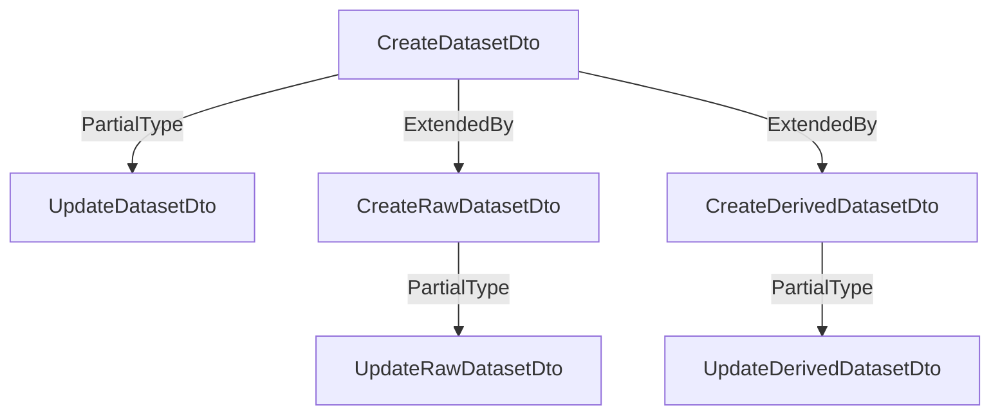

# Information on Datasets folder

The dataset models are just a little bit complicated as SciCat has two type of datasets: Raw and Derived.
Unfortunately, the normal class extension could not be used as it would create issues with the model creation and
the use of the decorators.
So here is the description of how Datasets are currently setup:
- Model and Schema: There is only one database schema defined which is the union of all the fields pertaining to both datasets (including the common one)
- DTO: A base dataset dto is defined and than extended in raw and derived dataset. This dtos are the classes responsibles for validating the input data.


Teh Model definition is not ideal, but it works at this time. It will be addressed after the backend migration to V4.

## Data Models

### __Dataset__
This object is the base class for dataset and it is extended by the Raw and Derived datasets class.

__Definition__

```yaml
name: Dataset
dto: 
  file: datasets/dto/create-dataset.dto.ts
  name: CreateDatasetDto
  extendes: OwnableDto
class:
  file: datasets/schemas/dataset.schema.ts
  names:
    class: DatasetClass
    schema: DatasetSchema
  extends: OwnableClass
  database:
    collection: Dataset
    minimize: false
    toJson:
      getters: true
legacy:
  files: 
    dataset: https://github.com/SciCatProject/backend/blob/master/common/models/dataset.json
    raw-dataset: https://github.com/SciCatProject/backend/blob/master/common/models/raw-dataset.json
    derived-dataset: https://github.com/SciCatProject/backend/blob/master/common/models/derived-dataset.json
fields:
  - name: pid
    type: string
    legacy:
      type: string
      id: true
      description: "Persistent Identifier for datasets derived from UUIDv4 and prepended automatically by site specific PID prefix like 20.500.12345/"
      defaultFn: uuidv4
      file: dataset
    dto:
      type: string
      readonly: true
      validation: 
        IsString: true
      swagger:
        type: String
        default: "function genUUID(): string { return process.env.PID_PREFIX + uuidv4(); }"
        description: "Persistent Identifier for datasets derived from UUIDv4 and prepended automatically by site specific PID prefix like 20.500.12345/"
    schema:
      type: string
      swagger:
        type: String
        default: "function genUUID(): string { return process.env.PID_PREFIX + uuidv4(); }"
        description: "Persistent Identifier for datasets derived from UUIDv4 and prepended automatically by site specific PID prefix like 20.500.12345/"
      database:
        type: String
        unique: true
        required: true
        default: "function genUUID(): string { return process.env.PID_PREFIX + uuidv4(); }"
  - name: _id
    type: string
    schema: 
      type: string
      database:
        type: String
  - name: owner
    type: string
    legacy:
      type: string
      required: true
      index: true
      description: "Owner or custodian of the dataset, usually first name + last name. The string may contain a list of persons, which should then be separated by semicolons."
      file: dataset
    schema:
      type: string
      swagger:
        type: String,
        description: "Owner or custodian of the dataset, usually first name + last name. The string may contain a list of persons, which should then be separated by semicolons."
      database:
        type: String
        required: true
        index: true 
  - name: ownerEmail
    type: string
    legacy:
      type: string
      description: "Email of the owner or custodian of the dataset. The string may contain a list of emails, which should then be separated by semicolons."
      file: dataset
    schema:
      type: string
      swagger: 
        type: String
        required: false
        description: "Email of the owner or custodian of the dataset. The string may contain a list of emails, which should then be separated by semicolons."
      database:
        type: String
        required: false
  - name: orcidOfOwner
    type: string
    legacy:
      type: string
      description: "ORCID of the owner or custodian. The string may contain a list of ORCIDs, which should then be separated by semicolons."
      file: dataset
    schema:
      type: string
      swagger:
        type: String
        required: false
        description: "ORCID of the owner or custodian. The string may contain a list of ORCIDs, which should then be separated by semicolons."
      database:
        type: String
        required: false
  - name: contactEmail
    type: string
    legacy:
      type: string
      required: true
      index: true
      description: "Email of contact person for this dataset. The string may contain a list of emails, which should then be separated by semicolons."
      file: dataset
    schema:
      swagger:
        type: String,
        required: true,
        description: "Email of contact person for this dataset. The string may contain a list of emails, which should then be separated by semicolons."
      database:
        type: String
        required: true
        index: true
  - name: sourceFolder
    type: string
    legacy:
      type: string
      required: true
      index: true
      description: "Absolute file path on file server containing the files of this dataset, e.g. /some/path/to/sourcefolder. In case of a single file dataset, e.g. HDF5 data, it contains the path up to, but excluding the filename. Trailing slashes are removed."
      file: dataset
    schema:
      type: string
      swagger: 
        type: String
        required: true,
        description: "Absolute file path on file server containing the files of this dataset, e.g. /some/path/to/sourcefolder. In case of a single file dataset, e.g. HDF5 data, it contains the path up to, but excluding the filename. Trailing slashes are removed."
      database:
        type: String
        required: true
        index: true
        set: "function stripSlash(v: string): string { if (v === "/") return v; return v.replace(/\/$/, "");"
  - name: sourceFolderHost
    type: string
    legacy:
      type: string
      required: false
      index: true
      description: "DNS host name of file server hosting sourceFolder, optionally including a protocol e.g. [protocol://]fileserver1.example.com"
      file: dataset
    schema:
      type: string
      swagger:
        type: String
        required: false
        description: "DNS host name of file server hosting sourceFolder, optionally including a protocol e.g. [protocol://]fileserver1.example.com"
      database:
        type: String
        required: false
        index: true
  - name: size
    type: number
    legacy:
      type: number
      index: true
      description: "Total size of all source files contained in source folder on disk when unpacked"
      file: dataset
    schema:
      type: number
      swagger:
        type: Number
        default: 0
        required: true
        description: "Total size of all source files contained in source folder on disk when unpacked"
      database:
        type: Number, 
        required: true
        index: true,
        default: 0
  - name: packedSize
    type: number
    legacy:
      type: number
      description: "Total size of all datablock package files created for this dataset"
      file: dataset
    schema:
      type: number
      swagger:
        type: Number
        default: 0
        required: true
        description: "Total size of all datablock package files created for this dataset"
      database:
        type: Number
        rewuired: true
        default: 0
  - name: numberOfFiles
    type: number
    legacy:
      type: number
      description: "Total number of files in all OrigDatablocks for this dataset"
      file: dataset
    schema: 
      type: number
      swagger:
        type: Number
        required: true
        default: 0
        description: "Total number of files in all OrigDatablocks for this dataset"
      database:
        type: Number
        required: true
        default: 0
  - name: numberOfFilesArchived
    type: number
    legacy:
      type: number
      description: "Total number of files in all Datablocks for this dataset"
      file: dataset
    schema:
      type: number
      swagger:
        type: Number
        default: 0
        required: true
        description: "Total number of files in all Datablocks for this dataset"
      database:
        type: Number
        default: 0
        required: true
  - name: creationTime
    type: Date
    legacy:
      type: date
      required: true
      index: true
      description: "Time when dataset became fully available on disk, i.e. all containing files have been written. Format according to chapter 5.6 internet date/time format in RFC 3339. Local times without timezone/offset info are automatically transformed to UTC using the timezone of the API server."
      file: dataset
    schema:
      type: Date
      swagger:
        type: Date,
        required: true
        description: "Time when dataset became fully available on disk, i.e. all containing files have been written. Format according to chapter 5.6 internet date/time format in RFC 3339. Local times without timezone/offset info are automatically transformed to UTC using the timezone of the API server."
    database:
      type: Date
      required: true
      index: true
  - name: type
    type: string
    legacy:
      type: string
      required: true
      index: true
      description: "Characterize type of dataset, either 'base' or 'raw' or 'derived'. Autofilled when choosing the proper inherited models"
      file: dataset
    model:
      swagger:
        type: String,
        required: true
        description: "Characterize type of dataset, either 'base' or 'raw' or 'derived'. Autofilled when choosing the proper inherited models"
      model:
        type: String
        required: true
        enum: [ DatasetType.Raw, DatasetType.Derived ]
        index: true
  - name: validationStatus
    type: string
    legacy:
      type: string
      description: "Defines a level of trust, e.g. a measure of how much data was verified or used by other persons"
      file: dataset
    model:
      swagger:
        type: String,
        required: false
        description: "Defines a level of trust, e.g. a measure of how much data was verified or used by other persons"
      database:
        type: String
        required: false
  - name: keywords
    type: string[]
    legacy:
      type: [string]
      description: "Array of tags associated with the meaning or contents of this dataset. Values should ideally come from defined vocabularies, taxonomies, ontologies or knowledge graphs"
      file: dataset
    schema:
      type: string[]
      swagger: 
        type: [String],
        required: false,
        description: "Array of tags associated with the meaning or contents of this dataset. Values should ideally come from defined vocabularies, taxonomies, ontologies or knowledge graphs"
      database: 
        type: [String]
        required: false
  - name: description
    type: string
    legacy:
      type: string
      description: "Free text explanation of contents of dataset"
      file: dataset
    schema:
      type: string
      swagger:
        type: String
        required: false
        description: "Free text explanation of contents of dataset",
      database:
        type: String
        required: false
  - name: datasetName
    type: string;
    legacy:
      type: string
      index: true
      description: "A name for the dataset, given by the creator to carry some semantic meaning. Useful for display purposes e.g. instead of displaying the pid. Will be autofilled if missing using info from sourceFolder"
      file: dataset
    schema:
      swagger:
        type: String
        required: false
        description: "A name for the dataset, given by the creator to carry some semantic meaning. Useful for display purposes e.g. instead of displaying the pid. Will be autofilled if missing using info from sourceFolder"
      database:
        type: String
        required: false
        default: |
          function datasetName() { 
            const sourceFolder = (this as DatasetDocument).sourceFolder; 
            if (!sourceFolder) return ""; 
            const arr = sourceFolder.split("/");
            if (arr.length == 1) return arr[0];
            else return arr[arr.length - 2] + "/" + arr[arr.length - 1];
          },
  - name: classification
    type: string
    legacy:
      type: string
      description: "ACIA information about AUthenticity,COnfidentiality,INtegrity and AVailability requirements of dataset. E.g. AV(ailabilty)=medium could trigger the creation of a two tape copies. Format 'AV=medium,CO=low'"
      file: dataset
    schema:
      type: string
      swagger:
        type: String,
        required: false
        description: "ACIA information about AUthenticity,COnfidentiality,INtegrity and AVailability requirements of dataset. E.g. AV(ailabilty)=medium could trigger the creation of a two tape copies. Format 'AV=medium,CO=low'",
      database:
        type: String
        required: false
  - name: license
    type: string;
    legacy:
      type: string
      description: "Name of the license under which the data can be used."
      file: dataset
    schema:
      type: string
      swagger:
        type: String
        required: false
        description: "Name of the license under which the data can be used."
      database:
        type: String
        required: false
  - name: version
    type: string
    legacy:
      type: string
      description: "Version of the API used in creation of the dataset."
      file: dataset
    schema:
      type: string
      swagger: 
        type: String
        required: false
        description: "Version of the API used in creation of the dataset."
      database:
        type: String
        required: false
  - name: isPublished
    type: boolean
    legacy:
      type: boolean
      index: true,
      description: "Flag is true when data are made publicly available"
      file: dataset
    schema:
      type: boolean
      swagger:
        type: Boolean
        required: true
        description: "Flag is true when data are made publicly available"
      database:
        type: Boolean
        required: true
        default: false
  - name: history
    type: History[]
    legacy:
      type: embedsMany
      model: Message
      property: history
      options:
        validate: false
        forceId: false
        persistent: true
      file: dataset
    schema:
      type: History[]
      swagger:
        type: History
        required: false
        default: {}
        description: "List of objects containing old and versions of the dataset."
      database:
        type: [HistorySchema]
        required: false
        default: {}
  - name: datasetlifecycle
    type: Lifecycle
    legacy:
      type: embedsOne
      model: DatasetLifecycle
      property: datasetlifecycle
      options:
        validate: true
        forceId: false
      file: dataset
    schema:
      type: Lifecycle
      swagger:
        type: Lifecycle
        required: false
        default: {}
        description: "Describes the current status of the dataset during its lifetime with respect to the storage handling systems."
      database:
        type: LifecycleSchema
        default: {}
        required: false
  - name: techniques
    type: Technique[]
    legacy:
      type: embedsMany
      model: Technique
      property: techniques
      file: dataset
    schema:
      type: Technique[]
      swagger:
        type: "array"
        items_ref_schema: Technique
        required: false
        default: []
        description: "Stores the metadata information for techniques"
      database: 
        type: [TechniqueSchema]
        required: false
        default: []
  - name: relationships
    type: Relationship[]
    schema:
      type: Relationship[]
      swagger: 
        type: "array"
        items_ref_schema: Relationship
        required: false
        default: []
        description: "Stores the relationships with other datasets"
      database:
        type: [RelationshipSchema]
        required: false
        default: []
  - name: sharedWith
    type: string[]
    legacy: 
      type: [string],
      description: "List of users that the dataset has been shared with"
      file: dataset
    schema:
      type: string[]
      swagger:
        type: [String]
        required: false
        default: []
        description: "List of users that the dataset has been shared with"
      database:
        type: [String]
        required: false
        default: []
  - name: attachments
    type: Attachment[]
    legacy:
      type: hasMany
      model: Attachment
      foreignKey: ""
      file: dataset
    schema:
      type: Attachment[]
      swagger:
        type: "array"
        items_ref_schema: Attachment
        description: "Small less than 16 MB attachments, envisaged for png/jpeg previews"
      database:
        type: [AttachmentSchema]
  - name: origdatablocks
    type: OrigDatablock[]
    legacy:
      type: hasMany
      model: OrigDatablock
      foreignKey: ""
      file: dataset
    schema:
      type: OrigDatablock[]
      swagger:
        type: "array"
        items_ref_schema: OrigDatablock
        description: "Containers that list all files and their attributes which make up a dataset. Usually filled at the time the dataset's metadata is created in the data catalog. Can be used by subsequent archiving processes to create the archived datasets."
      database:
        type: [OrigDatablockSchema]
  - name: datablocks
    type: Datablock[]
    legacy:
      type: hasMany
      model: Datablock
      foreignKey: ""
      file: dataset
    schema:
      type: Datablock[]
      swagger:
        type: "array",
        items_ref_schema: Datablock
        description: "When archiving a dataset, all files contained in the dataset are listed here together with their checksum information. Several datablocks can be created if the file listing is too long for a single datablock. This partitioning decision is done by the archiving system to allow for chunks of datablocks with manageable sizes. E.g a datasets consisting of 10 TB of data could be split into 10 datablocks of about 1 TB each. The upper limit set by the data catalog system itself is given by the fact that documents must be smaller than 16 MB, which typically allows for datasets of about 100000 files."
      database:
        type: [DatablockSchema]
  - name: scientificMetadata
    type: Record<string, unknown>
    schema:
      type: Record<string, unknown>
      swagger:
        type: Object
        required: false
        default: {}
        description: "JSON object containing the scientific metadata"
      detabase:
        type: Object
        required: false
        default: {}
  - name: dataQualityMetrics
    legacy:
      type: number
      description: "Rate the quality of a dataset. The field is only relevant for user working on a given proposal and know what type of data quality this rating refer to. A number between 1-3 that the user could use to rate a dataset. 1 means bad, 2 means good, 3 means very good"
  - name: comments
    legacy: 
      type: string
      description: "Comment the user has about a given dataset."
  - name: publisheddata
    legacy:
      type: hasAndBelongsToMany
      model: PublishedData
  
  #
  # fields related to Raw Datasets
  # This fields are decleared in CreateRawDatasetDto
  #
  - name: principalInvestigator
    type: string
    legacy:
      type: string
      required: true
      description: "Email of principal investigator"
      file: raw-dataset
    schema:
      type: string
      swagger:
        type: String
        required: false
        description: "Email of principal investigator. This field is required if the dataset is a Raw dataset."
      database:
        type: String
        required: false
  - name: endTime
    type: Date
    legacy:
      type: date
      description: "Time of end of data taking for this dataset, format according to chapter 5.6 internet date/time format in RFC 3339. Local times without timezone/offset info are automatically transformed to UTC using the timezone of the API server"
      file: raw-dataset
    schema:
      type: Date
      swagger:
        type: Date
        required: false
        description: "Time of end of data taking for this dataset, format according to chapter 5.6 internet date/time format in RFC 3339. Local times without timezone/offset info are automatically transformed to UTC using the timezone of the API server. This field is required if the dataset is a Raw dataset."
      dataset:
        type: Date
        required: false
  - name: creationLocation
    type: string
    legacy:
      type: string
      required: true
      index: true
      description": "Unique location identifier where data was taken, usually in the form /Site-name/facility-name/instrumentOrBeamline-name"
      file: raw-dataset
    schema:
      type: string
      swagger:
        type: String
        required: false
        description: "Unique location identifier where data was taken, usually in the form /Site-name/facility-name/instrumentOrBeamline-name. This field is required if the dataset is a Raw dataset."
      model:
        type: String
        required: false
        index: true
  - name: dataFormat
    type: string
    legacy:
      type: string
      description: "Defines format of subsequent scientific meta data, e.g Nexus Version x.y"
      file: raw-dataset
    schema:
      type: string
      swagger:
        type: String
        required: false
        description: "Defines format of subsequent scientific meta data, e.g Nexus Version x.y."
      database:
        type: String
        required: false
  - name: proposalId
    type: string
    legacy:
      proposal":
      type: belongsTo
      model: Proposal
      foreignKey: "" 
      file: raw-dataset
    schema:
      type: string
      swagger:
        type: String
        required: false
        description: "The ID of the proposal to which the dataset belongs."
      database:
        type: String
        ref: "Proposal"
        required: false
  - name: sampleId
    type: string
    legacy:
      type: belongsTo
      model: Sample
      foreignKey": ""
      file: raw-dataset
    schema:
      type: string
      swagger:
        type: String
        required: false
        description: "ID of the sample used when collecting the data."
      database:
        type: String
        ref: "Sample"
        required: false
  - name: instrumentId
    type: string
    legacy:
      type: belongsTo
      model: Instrument
      foreignKey: ""
      file: raw-dataset
    schema:
      type: string
      swagger:
        type: String
        required: false
        description: "ID of instrument where the data was created"
      database:
        type: String
        ref: "Instrument"
        required: false

  #
  # Derived Dataset
  # The following fields are addedd to the CreateDerivedDaatasetDto
  # 
  - name: investigator
    type: string
    legacy:
      type: string
      required: true
      index: true,
      description: "Email of person pursuing the data analysis. The string may contain a list of emails, which should then be separated by semicolons"
      file: derived-dataset
    schema:
      type: string
      swagger:
        type: String,
        required: false
        description: "Email of person pursuing the data analysis. The string may contain a list of emails, which should then be separated by semicolons. This field is required if the dataset is a Derived dataset. This file is required if the dataset is a Derived dataset"
      database:
        type: String
        required: false
        index: true
  - name: inputDatasets
    type: string[]
    legacy:
      type: [string]
      required: true
      description: "Array of input dataset identifiers used in producing the derived dataset. Ideally these are the global identifier to existing datasets inside this or federated data catalogs"
      file: derived-dataset
    schema:
      type: string[]
      swagger:
        type: [String]
        required: false
        description: "Array of input dataset identifiers used in producing the derived dataset. Ideally these are the global identifier to existing datasets inside this or federated data catalogs. This file is required if the dataset is a Derived dataset"
      database: 
        type: [String]
        required: false
  - name: usedSoftware
    type: string[]
    legacy:
      type: [string]
      required: true
      description: "A list of links to software repositories which uniquely identifies the software used and the version for yielding the derived data"
      file: derived-dataset
    schema:
      type: string[]
      swagger:
        type: [String]
        required: false
        description: "A list of links to software repositories which uniquely identifies the software used and the version for yielding the derived data. This file is required if the dataset is a Derived dataset"
      database:
        type: [String]
        required: false
  - name: jobParameters
    type: Record<string, unknown>
    legacy:
      type: object
      description: "The creation process of the drived data will usually depend on input job parameters. The full structure of these input parameters are stored here"
      file: derived-dataset
    schema:
      type: Record<string, unknown>
      swagger:
        type: Object
        required: false
        description: "The creation process of the drived data will usually depend on input job parameters. The full structure of these input parameters are stored here"
      database:
        type: Object
        required: false
  - name: jobLogData
    type: string
    legacy:
      type: string
      description: "The output job logfile. Keep the size of this log data well below 15 MB"
      file: derived-dataset
    schema:
      type: String
      swagger:
        type: String,
        required: false
        description: "The output job logfile. Keep the size of this log data well below 15 MB."
      database: 
        type: String
        required: false
```

  
