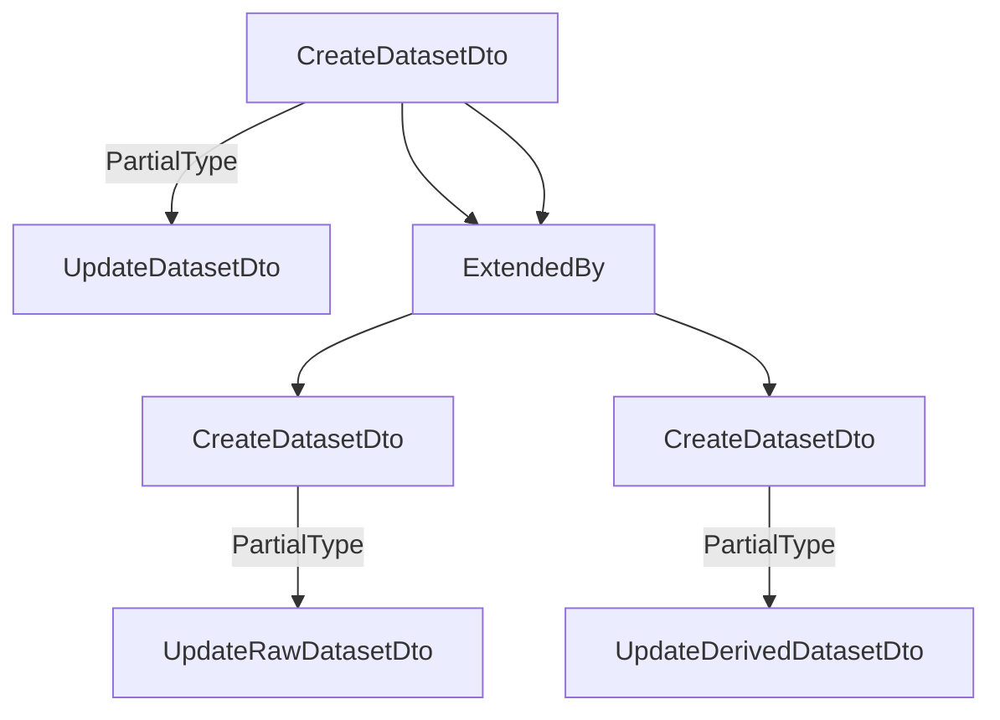

# Information on Datasets folder

The dataset models are just a little bit complicated as SciCat has two type of datasets: Raw and Derived.
Unfortunately, the normal class extension could not be used as it would create issues with the model creation and
the use of the decorators.
So here is the description of how Datasets are currently setup:
- Model and Schema: There is only one database schema defined which is the union of all the fields pertaining to both datasets (including the common one)
- DTO: A base dataset dto is defined and than extended in raw and derived dataset. This dtos are the classes responsibles for validating the input data.


Teh Model definition is not ideal, but it works at this time. It will be addressed after the backend migration to V4.

## Data Models

### __Dataset__
This object is the base class for dataset and it is extended by the Raw and Derived datasets class.

__Definition__

```yaml
name: DatasetClass
dto: 
  file: dto/Dataset.dto.ts
  name: DatasetDto
class:
  file: schemas/dataset.schema.ts
  name: DatasetClass
  extends: OwnableClass
  model:
    collection: Dataset
    minimize: false
    toJson:
      getters: true
schema:
  name: DatasetSchema
fields:
  - name: pid
    type: string
    dto:
      type: string
      validation: IsString
    swagger:
      type: String
      default: "function genUUID(): string { return process.env.PID_PREFIX + uuidv4(); }"
      description: "Persistent Identifier for datasets derived from UUIDv4 and prepended automatically by site specific PID prefix like 20.500.12345/"
    model:
      type: String
      unique: true
      required: true
      default: "function genUUID(): string { return process.env.PID_PREFIX + uuidv4(); }"
  - name: _id
    type: string
    model: 
      type: string
  - name: onwer
    type: string
    swagger:
      type: String,
      description: "Owner or custodian of the data set, usually first name + lastname. The string may contain a list of persons, which should then be seperated by semicolons."
    model:
      type: String
      required: true
      index: true 
  - name: ownerEmail
    type: string
    swagger: 
      type: String
      description: "Email of owner or of custodian of the data set. The string may contain a list of emails, which should then be seperated by semicolons."
    model:
      type: String
  - name: orcidOfOwner
    type: string
    swagger:
      type: String,
      description: "ORCID of owner/custodian. The string may contain a list of ORCID, which should then be separated by semicolons."
    model:
      type: String
  - name: contactEmail
    type: string
    swagger:
      type: String,
      description: "Email of contact person for this dataset. The string may contain a list of emails, which should then be seperated by semicolons."
    model:
      type: String
      required: true
      index: true
  - name: sourceFolder
    type: string
    swagger: 
      type: String
      description: "Absolute file path on file server containing the files of this dataset, e.g. /some/path/to/sourcefolder. In case of a single file dataset, e.g. HDF5 data, it contains the path up to, but excluding the filename. Trailing slashes are removed."
    model:
      type: String
      required: true
      index: true
      set: "function stripSlash(v: string): string { if (v === "/") return v; return v.replace(/\/$/, "");"
  - name: sourceFolderHost
    type: string
    swagger:
      type: String
      description: "DNS host name of file server hosting sourceFolder, optionally including protocol e.g. [protocol://]fileserver1.example.com"
    model:
      type: String
      index: true
  - name: size
    type: number
    swagger:
      type: Number,
      description: "Total size of all source files contained in source folder on disk when unpacked"
    model:
      type: Number, 
      index: true
  - name: packedSize
    type: number
    swagger:
      type: Number,
      description: "Total size of all datablock package files created for this dataset"
    model:
      type: Number
  - name: numberOfFiles
    type: number
    swagger:
      type: Number,
      description: "Total number of lines in filelisting of all OrigDatablocks for this dataset"
    model:
      type: Number
  - name: numberOfFilesArchived
    type: number
    swagger:
      type: Number,
      description: "Total number of lines in filelisting of all Datablocks for this dataset"
    model:
      type: Number
  - name: creationTime
    type: Date;
    swagger:
      type: Date,
      description: "Time when dataset became fully available on disk, i.e. all containing files have been written. Format according to chapter 5.6 internet date/time format in RFC 3339. Local times without timezone/offset info are automatically transformed to UTC using the timezone of the API server."
    model:
      type: Date
      required: true
      index: true
  - name: type
    type: string
    swagger:
      type: String,
      description: "Characterize type of dataset, either 'base' or 'raw' or 'derived'. Autofilled when choosing the proper inherited models"
    model:
      type: String
      required: true
      enum: [ DatasetType.Raw, DatasetType.Derived ]
      index: true
  - name: validationStatus
    type: string
    swagger:
      type: String,
      description: "Defines a level of trust, e.g. a measure of how much data was verified or used by other persons"
    model:
      type: String
  - name: keywords
    type: string[]
    swagger: 
      type: [String],
      description: "Array of tags associated with the meaning or contents of this dataset. Values should ideally come from defined vocabularies, taxonomies, ontologies or knowledge graphs"
    model: 
      type: [String]
  - name: description
    type: string
    swagger:
      type: String,
      description: "Free text explanation of contents of dataset",
    model:
      type: String
  - name: datasetName
    type: string;
    swagger:
      type: String,
      description: "A name for the dataset, given by the creator to carry some semantic meaning. Useful for display purposes e.g. instead of displaying the pid. Will be autofilled if missing using info from sourceFolder"
    model:
      default: |
        function datasetName() { 
            const sourceFolder = (this as DatasetDocument).sourceFolder; 
            if (!sourceFolder) return ""; 
            const arr = sourceFolder.split("/");
            if (arr.length == 1) return arr[0];
            else return arr[arr.length - 2] + "/" + arr[arr.length - 1];
        },
  - name: classification
    type: string;
    swagger:
      type: String,
      description: "ACIA information about AUthenticity,COnfidentiality,INtegrity and AVailability requirements of dataset. E.g. AV(ailabilty)=medium could trigger the creation of a two tape copies. Format 'AV=medium,CO=low'",
    model:
      type: String
  - name: license
    type: string;
    swagger:
      type: String
      description: "Name of license under which data can be used"
    model:
      type: String
  - name: version
    type: string;
    swagger: 
      type: String
      description: "Version of API used in creation of dataset"
    model:
      type: String
  - name: isPublished
    type: boolean
    swagger:
      type: Boolean
      description: "Flag is true when data are made publically available"
    model:
      type: Boolean
      default: false
  - name: history
    type: History[]
    swagger:
      type: History
      description: "List of objects containing old value and new value"
    model:
      type: [HistorySchema]
  - name: datasetlifecycle
    type: Lifecycle
    swagger:
      type: Lifecycle
      required: false
      description: "For each dataset there exists an embedded dataset lifecycle document which describes the current status of the dataset during its lifetime with respect to the storage handling systems"
    model:
      type: LifecycleSchema
      default: {}
      required: false
  - name: techniques
    type: Technique[]
    swagger:
      type: "array"
      items_ref_schema: Technique
      description: "Stores the metadata information for techniques"
    model: 
      type: [TechniqueSchema]
  - name: relationships
    type: Relationship[]
    swagger: 
      type: "array"
      items_ref_schema: Relationship
      description: "Stores the relationships with other datasets"
    model:
      type: [RelationshipSchema]
  - name: sharedWith
    type: string[]
    swagger:
      type: [String]
      description: "List of users that the dataset has been shared with"
    model:
      type: [String]
  - name: attachments
    type: Attachment[]
    swagger:
      type: "array"
      items_ref_schema: Attachment
      description: "Small less than 16 MB attachments, envisaged for png/jpeg previews"
    model:
      type: [AttachmentSchema]
  - name: origdatablocks
    type: OrigDatablock[]
    swagger:
      type: "array"
      items_ref_schema: OrigDatablock
      description: "Container list all files and their attributes which make up a dataset. Usually Filled at the time the datasets metadata is created in the data catalog. Can be used by subsequent archiving processes to create the archived datasets."
    model:
      type: [OrigDatablockSchema]
  - name: datablocks
    type: Datablock[]
    swagger:
      type: "array",
      items_ref_schema: Datablock
      description: "When archiving a dataset all files contained in the dataset are listed here together with their checksum information. Several datablocks can be created if the file listing is too long for a single datablock. This partitioning decision is done by the archiving system to allow for chunks of datablocks with managable sizes. E.g a dataset consisting of 10 TB of data could be split into 10 datablocks of about 1 TB each. The upper limit set by the data catalog system itself is given by the fact that documents must be smaller than 16 MB, which typically allows for datasets of about 100000 files."
    model:
      type: [DatablockSchema]
  - name: scientificMetadata
    type: Record<string, unknown>
    swagger:
      type: Object
      required: false
      default: {}
      description: "JSON object containing the scientific metadata"
    model:
      type: Object
      required: false
      default: {}
  
  #
  # fields related to Raw Datasets
  # This fields are decleared in CreateRawDatasetDto
  #
  - name: principalInvestigator
    type: string
    swagger:
      type: String
      required: false
      description: "Email of principal investigator. This field is required if the dataset is a Raw dataset."
    model:
      type: String
      required: false
  - name: endTime
    type: Date
    swagger:
      type: Date
      required: false
      description: "Time of end of data taking for this dataset, format according to chapter 5.6 internet date/time format in RFC 3339. Local times without timezone/offset info are automatically transformed to UTC using the timezone of the API server. This field is required if the dataset is a Raw dataset."
    model:
      type: Date
      required: false
  - name: creationLocation
    type: string
    swagger:
      type: String
      required: false
      description: "Unique location identifier where data was taken, usually in the form /Site-name/facility-name/instrumentOrBeamline-name. This field is required if the dataset is a Raw dataset."
    model:
      type: String
      required: false
      index: true
  - name: dataFormat
    type: string
    swagger:
      type: String
      required: false
      description: "Defines format of subsequent scientific meta data, e.g Nexus Version x.y"
    model:
      type: String
      required: false
  - name: proposalId
    type: string
    swagger:
      type: String
      required: false
      description: "The ID of the proposal to which the dataset belongs."
    model:
      type: String
      ref: "Proposal"
      required: false
  - name: sampleId
    type: string
    swagger:
      type: String
      required: false
      description: "ID of the sample used when collecting the data."
    model:
      type: String
      ref: "Sample"
      required: false
  - name: instrumentId
    type: string
    swagger:
      type: String
      required: false
      description: "ID of instrument where the data was created"
    model:
      type: String
      ref: "Instrument"
      required: false

  #
  # Derived Dataset
  # The following fields are addedd to the CreateDerivedDaatasetDto
  # 
  - name: investigator
    type: string
    swagger:
      type: String,
      required: false
      description: "Email of person pursuing the data analysis. The string may contain a list of emails, which should then be separated by semicolons. This field is required if the dataset is a Derived dataset."
    model:
      type: String
      required: false
      index: true
  - name: inputDatasets
    type: string[]
    swagger:
      type: [String],
      required: false
      description: "Array of input dataset identifiers used in producing the derived dataset. Ideally these are the global identifier to existing datasets inside this or federated data catalogs"
    model: 
      type: [String]
      required: false
  - name: usedSoftware
    type: string[]
    swagger:
      type: [String],
      description: "A list of links to software repositories which uniquely identifies the software used and the version for yielding the derived data"
    model:
      type: [String]
      required: false
  - name: jobParameters
    type: Record<string, unknown>
    swagger:
      type: Object,
      description: "The creation process of the drived data will usually depend on input job parameters. The full structure of these input parameters are stored here"
    model:
      type: Object
      required: false
  - name: jobLogData
    type: string
    swagger:
      type: String,
      description: "The output job logfile. Keep the size of this log data well below 15 MB "
    model: 
      type: String
      required: false
```

  
